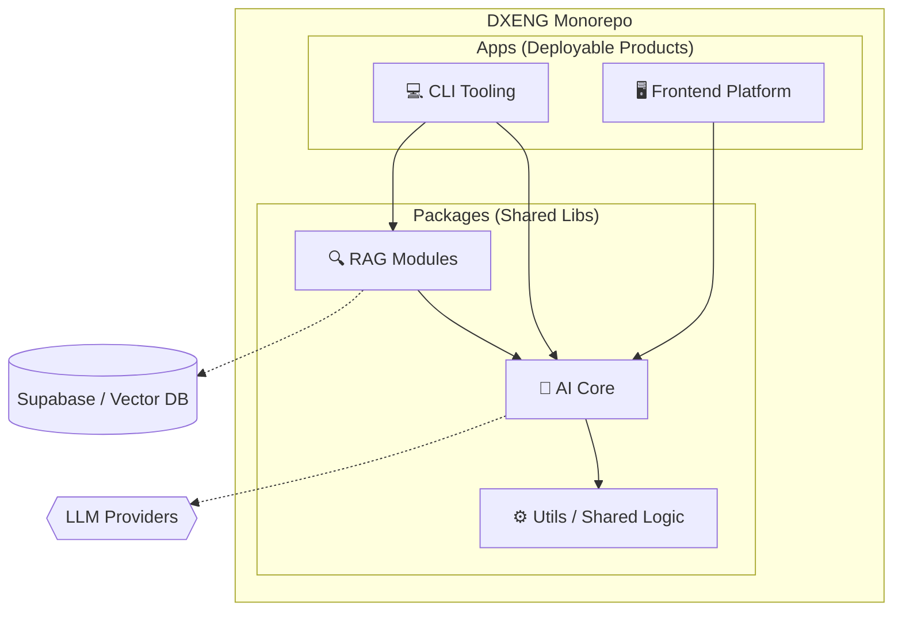

# DXENG · Developer Experience Platform


This repository is the **DXENG corporate monorepo**, the central platform for Developer Experience, automation, and engineering standardization within the organization.

---

## 🔭 1. Overview

**DXENG** is not just a repository of tools, but a unified strategy to reduce the cognitive load on engineering teams. It acts as a platform built upon three fundamental pillars:

###  Automation Platform
Orchestration of pipelines and tools (CLIs) that generate code, documentation, and technical artifacts consistently, eliminating repetitive tasks.

###  Standardization Platform
Centralization of decisions regarding architecture, security, observability, and code quality. By using DXENG modules, new projects are born **compliant** with company standards.

###  Discovery Platform
A living catalog of reusable internal components (internal `npm` packages, templates, AI agents), facilitating *Inner Source* among squads.

> **Goal:** To enable any new product initiative to rely on DXENG to quickly create a standardized technical skeleton, generate initial documentation, and natively plug into governance.

---

## 🛠️ 2. Tech Stack

The platform is agnostic regarding consumption but holds strong opinions on its internal construction to ensure maintainability.

| Domain | Key Technologies |
| :--- | :--- |
| **Core & Runtime** |  **Node.js** (LTS) & **TypeScript** |
| **Interfaces (Web/CLI)** | **Next.js** (Admin/Dashboards), **Commander/Oclif** (CLIs) |
| **AI & Data** | **LangChain/LangGraph** (LLM Orchestration), **Supabase** (Postgres/Auth), **Pinecone** (Vector Store/RAG) |
| **Build & Monorepo** | **Turborepo** (Workspace management), **npm workspaces**, **Docker** |
| **Quality** | **Biome/ESLint** (Linting), **Vitest** (Unit Testing) |

---

## 🏗️ 3. Macro-architecture

DXENG adopts a **Modular Monorepo** architecture, where logic is segregated between "Apps" (end products) and "Packages" (shared logic).



## 💻 Development Environment
To run the platform locally, ensure you have Node.js 20+ installed.

```Bash

# 1. Install dependencies at root (workspaces)
npm install

# 2. Configure environment variables
cp .env.example .env
# (Edit .env with your Supabase/LLM API keys)

# 3. Running the projects
# To run the frontend:
npm run dev --workspace=apps/frontend

# To run the CLI locally (link):
npm run dev --workspace=apps/cli
```

# 🤝 5. Governance
Documentation: Technical documentation for each module lives alongside the code (e.g., apps/frontend/README.md).

Contribution: Every change must go through a Pull Request, validated by CI (Lint/Build), and approved by at least one Code Owner.

Versioning: Internal packages follow semantic versioning to ensure stability for consumers.

## 👥 Authors
Gabriel Souza, Pedro Henrique Gago, Vinicius Nathan, Thiago Emanuel


*Project developed for Hackathon Base 2025.*


